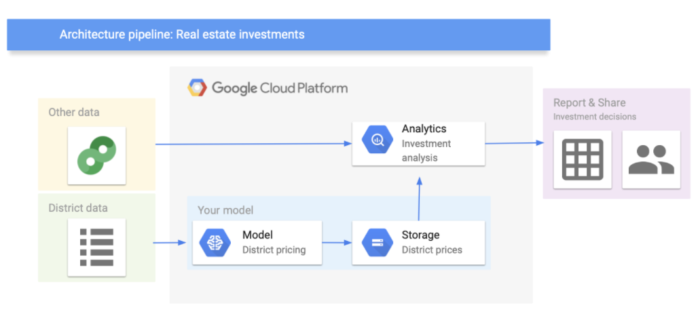

# (PART) CLASSIFICATION {-} 

# Introduction {#intro2}


```{r setup, include=FALSE}
knitr::opts_chunk$set(cache = TRUE, 
                      warning = FALSE,
                      message = FALSE, 
                      echo = TRUE, 
                      dpi = 300, 
                      cache.lazy = TRUE,
                      fig.width = 8, 
                      fig.height = 5,
                      eval=TRUE)
library(tidyverse)
library(skimr)
library(GGally)
library(ggmap)
library(tidymodels)
library(visdat)
library(corrr)
library(ggsignif)
library(gt)


# The number of physical cores of your hardware:
parallel::detectCores(logical = FALSE)
# The number of possible independent processes that can 
# be simultaneously used:  
#parallel::detectCores(logical = TRUE)

# Unix and macOS only
library(doMC)
registerDoMC(cores = 4)

theme_set(theme_classic())
```

In this chapter, we'll build the following classification models:

* logistic regression
* random forest,
* XGBoost (extreme gradient boosted trees),
* K-nearest neighbor

We use the same data and follow the same procedure as in our regression example.


# Business understanding

:::note
In business understanding, you:

- Define your (business) goal
- Frame the problem (regression, classification,...)
- Choose a performance measure
- Show the data processing components
:::

First of all, we take a look at the big picture and define the objective of our data science project in business terms.

In our example, the goal is to build a classification model to predict the type of median housing prices in districts in California. In particular, the model should learn from California census data and be able to predict wether the median house price in a district (population of 600 to 3000 people) is below or above a certain threshold, given some predictor variables. Hence, we face a **supervised learning** situation and should use a **classification model** to predict the categorical outcomes (below or above the preice). Furthermore, we use the **F1-Score** as a performance measure for our classification problem.

Note that in our classification example we again use the dataset from the previous regession tutorial. Therefore, we first need to create our categorical dependent variable from the numeric variable median house value. We will do this in the phase data understanding during the creation of new variables. Afterwards, we will remove the numeric variable median house value from our data. 

Let's assume that the model’s output will be fed to another analytics system, along with other data. This downstream system will determine whether it is worth investing in a given area or not. The **data processing components** (also called data pipeline) are shown in \@ref(fig:datapipeline-class) (you can use [Google's architectural templates](https://docs.google.com/presentation/d/1vjm5YdmOH5LrubFhHf1vlqW2O9Z2UqdWA8biN3e8K5U/edit#slide=id.g19b41f69d7_2_265) to draw the data pipeline).

```{r datapipeline-class, fig.margin = TRUE, echo = FALSE, fig.width = 3, fig.cap = "Data processing components"}



```


# Data understanding

:::note
In Data Understanding, you:

- Import data 
- Clean data
- Format data properly
- Create new variables
- Get an overview about the complete data
- Split data into training and test set using stratified sampling
- Discover and visualize the data to gain insights 
:::

## Imort Data

First of all, let's import the data:

```{r}
library(tidyverse)

LINK <- "https://raw.githubusercontent.com/kirenz/datasets/master/housing_unclean.csv"
housing_df <- read_csv(LINK)

```


## Clean data

To get an first impression of the data we take a look at the top 4 rows of the DataFrame: 

```{r}

head(housing_df, 4)

```

Notice the values in the first row of the variables `housing_median_age`and `median_house_value`. We need to remove the strings "years" and "$". Therefore, we use the function `str_remove_all` from the `stringr` package. Since there could be multiple wrong entries of the same type, we apply our corrections to all of the rows of the corresponding variable:

```{r}
library(stringr)

housing_df <- 
  housing_df %>% 
  mutate(
    housing_median_age = str_remove_all(housing_median_age, "[years]"),
    median_house_value = str_remove_all(median_house_value, "[$]")
  )

```

We don't cover the phase of data cleaning in detail in this tutorial. However, in a real data science project, data cleaning is usually a very time consuming process.

## Format data

Next, we take a look at the data structure and check wether all data formats are correct:

* Numeric variables should be formatted as integers (`int`) or double precision floating point numbers (`dbl`).

* Categorical (nominal and ordinal) variables should usually be formatted as factors (`fct`) and not characters (`chr`). Especially, if they don't have many levels.

```{r}

glimpse(housing_df)

```

The package `visdat` helps us to explore the data class structure visually:

```{r}
library(visdat)

vis_dat(housing_df)

```

We can observe that the numeric variables `housing_media_age` and `median_house_value` are declared as characters (`chr`) instead of numeric. We choose to format the variables as `dbl`, since the values could be floating-point numbers. 

Furthermore, the categorical variable `ocean_proximity` is formatted as character instead of factor. Let's take a look at the levels of the variable: 

```{r}

housing_df %>% 
  count(ocean_proximity,
        sort = TRUE)

```

The variable has only 5 levels and therefore should be formatted as a factor.

Note that it is usually a good idea to first take care of the numerical variables. Afterwards, we can easily convert all remaining character variables to factors using the function `across` from the dplyr package (which is part of the tidyverse).

```{r}

# convert to numeric
housing_df <- 
  housing_df %>% 
  mutate(
    housing_median_age = as.numeric(housing_median_age),
    median_house_value = as.numeric(median_house_value)
  )

# convert all remaining character variables to factors 
housing_df <- 
  housing_df %>% 
  mutate(across(where(is.character), as.factor))

```


## Missing data

Now let's turn our attention to missing data. Missing data can be viewed with the function `vis_miss` from the package `visdat`. We arrange the data by columns with most missingness: 

```{r}

vis_miss(housing_df, sort_miss = TRUE)

```

Here an alternative method to obtain missing data: 

```{r}

is.na(housing_df) %>% colSums()

```

We have a missing rate of 0.1% (207 cases) in our variable `total_bedroms`. This can cause problems for some algorithms. We will take care of this issue during our data preparation phase. 


## Create new variables 

One very important thing you may want to do at the beginning of your data science project is to create new variable combinations. For example:

* the *total number of rooms* in a district is not very useful if you don’t know how many households there are. What you really want is the *number of rooms per household*. 

* Similarly, the total number of bedrooms by itself is not very useful: you probably want to compare it to the number of rooms. 

* And the *population per household* also seems like an interesting attribute combination to look at. 

Let’s create these new attributes:

```{r}

housing_df <- 
  housing_df %>% 
  mutate(rooms_per_household = total_rooms/households,
        bedrooms_per_room = total_bedrooms/total_rooms,
        population_per_household = population/households)

```

Furthermore, in our example we need to create our dependent variable and drop the original numeric variable:

```{r}
housing_df <- 
  housing_df %>% 
  mutate(price_category = case_when( 
    median_house_value < 150000 ~ "below",
    median_house_value >= 150000 ~ "above",
    )) %>% 
  mutate(price_category = as.factor(price_category)) %>% 
  select(-median_house_value)
```

Take a look at our dependent variable and  create a table with the package [`gt`](https://gt.rstudio.com/) 

```{r}
library(gt)

housing_df %>% 
  count(price_category, # count observations
        name ="districts_total") %>%  # name the new variable 
  mutate(percent = districts_total/sum(districts_total)) %>%  # calculate percentages
  gt() # create table
  
```

Let's make a nice looking table:

```{r}

housing_df %>% 
  count(price_category, 
        name ="districts_total") %>%
  mutate(percent = districts_total/sum(districts_total)) %>%
 gt() %>%
  tab_header(
    title = "California median house prices",
    subtitle = "Districts above and below 150.000$"
  ) %>%
  cols_label(
    price_category = "Price",
    districts_total = "Districts",
    percent = "Percent"
  ) %>% 
  fmt_number(
    columns = vars(districts_total),
    suffixing = TRUE
  ) %>% 
  fmt_percent(
    columns = vars(percent),
    decimal = 2
  )

```


## Data overview  

After we took care of our data problems, we can obtain a data summary of all numerical and categorical attributes using a function from the package `skimr`:

```{r}

skim(housing_df)

```

We have `r nrow(housing_df)` observations and `r ncol(housing_df)` columns in our data.

* The `sd` column shows the standard deviation, which measures how dispersed the values are. 

* The p0, p25, p50, p75 and p100 columns show the corresponding percentiles: a percentile indicates the value below which a given percentage of observations in a group of observations fall. For example, 25% of the districts have a `housing_median_age` lower than 18, while 50% are lower than 29 and 75% are lower than 37. These are often called the 25th percentile (or first quartile), the median, and the 75th percentile.

* Further note that the **median income** attribute does not look like it is expressed in US dollars (USD). Actually the data has been scaled and capped at 15 (actually, 15.0001) for higher median incomes, and at 0.5 (actually, 0.4999) for lower median incomes. The numbers represent roughly tens of thousands of dollars (e.g., 3 actually means about $30,000).


Another quick way to get an overview of the type of data you are dealing with is to plot a histogram for each numerical attribute. A histogram shows the number of instances (on the vertical axis) that have a given value range (on the horizontal axis). You can either plot this one attribute at a time, or you can use `ggscatmat` from the package `GGally` on the whole dataset (as shown in the following code example), and it will plot a histogram for each numerical attribute as well as  correlation coefficients (Pearson is the default). We just select the most promising variabels for our plot:


```{r}
library(GGally)

housing_df %>% 
  select(
    housing_median_age, 
    median_income, bedrooms_per_room, rooms_per_household, 
    population_per_household) %>% 
  ggscatmat(alpha = 0.2)

```

Another option is to use `ggpairs`, where we even can integrate categorical variables like our dependent variable `price_category` and ocean proximity in the output:

```{r}
library(GGally)

housing_df %>% 
  select(
    housing_median_age, 
    median_income, bedrooms_per_room, rooms_per_household, 
    population_per_household, ocean_proximity,
    price_category) %>% 
  ggpairs()

```

There are a few things you might notice in these histograms:

* The variables *median income*, *housing median age* were capped. 

* Note that our attributes have very different scales. We will take care of this issue later in data preparation, when we use feature scaling (data normalization).

* Finally, many histograms are tail-heavy: they extend much farther to the right of the median than to the left. This may make it a bit harder for some Machine Learning algorithms to detect patterns. We will transform these attributes later on to have more bell-shaped distributions. For our right-skewed data (i.e., tail is on the right, also called positive skew), common transformations include square root and log (we will use the log). 


## Data splitting

Before we get started with our in-depth data exploration, let’s split our single dataset into two: a training set and a testing set. The training data will be used to fit models, and the testing set will be used to measure model performance. We perform data exploration only on the training data.

A **training dataset** is a dataset of examples used during the learning process and is used to fit the models. A **test dataset** is a dataset that is independent of the training dataset and is used to evaluate the performance of the final model. If a model fit to the training dataset also fits the test dataset well, minimal *overfitting* has taken place. A better fitting of the training dataset as opposed to the test dataset usually points to overfitting.

In our data split, we want to ensure that the training and test set is representative of the  categories of our dependent variable. Take a look at \@ref(fig:hist-med-value-class)


```{r hist-med-value-class, fig.cap="Histogram of Median Proces", out.width='80%'}

housing_df %>% 
  ggplot(aes(price_category)) +
  geom_bar() 

```

In general, we would like to have instances for each *stratum*, or else the estimate of a stratum's importance may be biased. A *stratum* (plural strata) refers to a subset (part) of the whole data from which is being sampled. We only have two categories in our data. 

To actually split the data, we can use the `rsample` package (included in `tidymodels`) to create an object that contains the information on how to split the data (which we call `data_split`), and then two more `rsample` functions to create data frames for the training and testing sets:

```{r}

# Fix the random numbers by setting the seed 
# This enables the analysis to be reproducible 
set.seed(123)

# Put 3/4 of the data into the training set 
data_split <- initial_split(housing_df, 
                           prop = 3/4, 
                           strata = price_category)

# Create dataframes for the two sets:
train_data <- training(data_split) 
test_data <- testing(data_split)

```


## Data exploration

The point of data exploration is to gain insights that will help you select important variables for your model and to get ideas for feature engineering in the data preparation phase. Ususally, data exploration is an iterative process: once you get a prototype model up and running, you can analyze its output to gain more insights and come back to this exploration step. It is important to note that we perform data exploration only with our training data.


### Create data copy 

We first make a copy of the training data since we don't want to alter our data during data exploration. 

```{r}

data_explore <- train_data

```

Next, we take a closer look at the relationships between our variables. In particular, we are interested in the relationships between our *dependent* variable `price_category` and all other variables. The goal is to identify possible *predictor variables* which we could use in our models to predict the `price_category`. 


### Geographical overview

Since our data includes information about `longitude` and `latitude`, we start our data exploration with the creation of a geographical scatterplot of the data to get some first insights: 

```{r point-long-lat-class, fig.cap="Scatterplot of longitude and latitude", out.width='80%'}

data_explore %>% 
  ggplot(aes(x = longitude, y = latitude)) +
  geom_point(color = "cornflowerblue")

```

A better visualization that highlights high-density areas (with parameter `alpha = 0.1` ):

```{r point-long-lat-a-class, fig.cap="Scatterplot of longitude and latitude that highlights high-density areas", out.width='80%'}

data_explore %>% 
  ggplot(aes(x = longitude, y = latitude)) +
  geom_point(color = "cornflowerblue", alpha = 0.1) 
  
```

Overview about California housing prices: 

- red is expensive, 
- purple is cheap and 
- larger circles indicate areas with a larger population.


```{r plot-ca-prices-class, fig.cap="California housing_df prices", out.width='80%'}

data_explore %>% 
  ggplot(aes(x = longitude, y = latitude)) +
  geom_point(aes(size = population, color = price_category), 
             alpha = 0.4)

```

Lastly, we add a map to our data:

```{r}
library(ggmap)

qmplot(x = longitude, 
       y = latitude, 
       data = data_explore, 
       geom = "point", 
       color = price_category, 
       size = population,
       alpha = 0.4) +
  scale_alpha(guide = 'none') # don't show legend for alpha

```

This image tells you that the housing prices are very much related to the location (e.g., close to the ocean) and to the population density. Hence our `ocean_proximity` variable may be a useful predictor of our categorical price variable median housing prices, although in Northern California the housing prices in coastal districts are not too high, so it is not a simple rule.

### Numerical variables

We can use boxplots to check, if we actually find differences in our numeric variables for the different levels of our dependent *categorical variable*:


```{r}

data_explore %>% 
  ggplot(aes(x = price_category, y = median_income, 
             fill = price_category, color = price_category)) +
  geom_boxplot(alpha=0.4) 
  
```

Let`s define a function for this task that accepts strings as inputs so we don't have to copy and paste our code for every plot. Note that we only have to change the "y-variable" in every  plot.

```{r}

print_boxplot <- function(.y_var){
  
  # convert strings to variable
  y_var <- sym(.y_var) 
 
  # unquote variables using {{}}
  data_explore %>% 
  ggplot(aes(x = price_category, y = {{y_var}},
             fill = price_category, color = price_category)) +
  geom_boxplot(alpha=0.4) 
  
}  

```

Obtain all of the names of the y-variables we want to use for our plots:

```{r}

y_var <- 
  data_explore %>% 
  select(where(is.numeric), -longitude, - latitude) %>% 
  variable.names() # obtain name

```

The map function applys the function `print_boxplot` to each element of our atomic vector `y_var` and returns the according plot:

```{r}
library(purrr)

map(y_var, print_boxplot)

```


We can observe a difference in the price_category:

* The differences between our two groups are quite small for `housing_median_age`, `total_room`, `total_bedrooms`, `population` and `households`

* We can observe a noticeable difference for our variables `median_income` and `bedrooms_per_room`

* `population_per_household` and `rooms_per_household` include some extreme values We first need to fix this before we can proceed with our interpretations for this variabels.


Again, let's write a short function for this task and filter some of the extreme cases. We call the new function `print_boxplot_out`:

```{r}
print_boxplot_out <- function(.y_var_out){
  
  y_var <- sym(.y_var_out) 
 
  data_explore %>% 
  filter(rooms_per_household < 50, population_per_household < 20) %>% 
  ggplot(aes(x = price_category, y = {{y_var}},
             fill = price_category, color = price_category)) +
  geom_boxplot(alpha=0.4) 
  
} 

y_var_out <- 
  data_explore %>% 
  select(rooms_per_household, population_per_household) %>% 
  variable.names() 

map(y_var_out, print_boxplot_out)


```


Now we are able to recognize a small difference for `population_per_household`. `rooms_per_household` on the other hand is quite similar for both groups.


Additionally, we can use the function `ggscatmat` to create plots with our dependent variable as color column:

```{r }

library(GGally)

data_explore %>% 
  select(price_category, median_income, bedrooms_per_room, rooms_per_household, 
         population_per_household) %>% 
  ggscatmat(color="price_category", 
            corMethod = "spearman",
            alpha=0.2)

```


There are a few things you might notice in these histograms:

* Note that our attributes have very different scales. We will take care of this issue later in data preparation, when we use feature scaling (data normalization).

* The histograms are tail-heavy: they extend much farther to the right of the median than to the left. This may make it a bit harder for some Machine Learning algorithms to detect patterns. We will transform these attributes later on to have more bell-shaped distributions. For our right-skewed data (i.e., tail is on the right, also called positive skew), common transformations include square root and log (we will use the log). 


As a result of our data exploration, we will include the numerical variables 

* `median_income`, 
* `bedrooms_per_room` and 
* `population_per_household` 

as predictors in our model. 


### Categorical variables

Now let's analyze the relationship between our categorical variables `ocean proximity` and `price_category`. We start with a simple count.

```{r}
library(gt)

data_explore %>% 
  count(price_category, ocean_proximity) %>% 
  group_by(price_category) %>% 
  mutate(percent = n / sum(n) ) %>% 
  gt() %>% 
    tab_header(
    title = "California median house prices",
    subtitle = "Districts above and below 150.000$"
  ) %>% 
  cols_label(
    ocean_proximity = "Ocean Proximity",
    n = "Districts",
    percent = "Percent"
  ) %>% 
  fmt_number(
    columns = vars(n),
    suffixing = TRUE
  ) %>% 
  fmt_percent(
    columns = vars(percent),
    decimal = 2
  ) 
  

```

The function `geom_bin2d()` creats a heatmap by counting the number of cases in each group, and then mapping the number of cases to each subgroub's fill.  

```{r}
data_explore %>%
  ggplot(aes(price_category, ocean_proximity)) +
  geom_bin2d() +
  scale_fill_continuous(type = "viridis") 
```

We can observe that most districts with a median house price above 150,000 have an ocean proximity below 1 hour. On the other hand, districts below that threshold are typically inland. Hence, ocean proximity is indeed a good predictor for our two different median house value categories. 


# Data preparation


:::note
Data preparation:

- Handle missing values
- Fix or remove outliers  
- Feature selection
- Feature engineering
- Feature scaling
- Create a validation set
:::

Next, we’ll preprocess our data before training the models. We mainly use the tidymodels packages `recipes` and `workflows` for this steps. `Recipes` are built as a series of optional data preparation steps, such as:

* *Data cleaning*: Fix or remove outliers, fill in missing values (e.g., with zero, mean, median…) or drop their rows (or columns).

* *Feature selection*: Drop the attributes that provide no useful information for the task.

* *Feature engineering*: Discretize continuous features, decompose features (e.g., the weekday from a date variable, etc.), add promising transformations of features (e.g., log(x), sqrt(x), x2 , etc.) or aggregate features into promising new features (like we already did).

* *Feature scaling*: Standardize or normalize features.

We will want to use our recipe across several steps as we train and test our models. To simplify this process, we can use a *model workflow*, which pairs a model and recipe together. 

## Data preparation

Before we create our `recipes`, we first select the variables which we will use in the model.  Note that we keep `longitude` and `latitude` to be able to map the data in a later stage but we will not use the variables in our model. 

```{r}

housing_df_new <-
  housing_df %>% 
  select( # select our predictors
    longitude, latitude, 
    price_category, 
    median_income, 
    ocean_proximity, 
    bedrooms_per_room, 
    rooms_per_household, 
    population_per_household
         )

glimpse(housing_df_new)


```

Furthermore, we need to make a new data split since we updated the original data. 

```{r}
set.seed(123)

data_split <- initial_split(housing_df_new, # updated data
                           prop = 3/4, 
                           strata = price_category)

train_data <- training(data_split) 
test_data <- testing(data_split)

```

## Data prepropecessing recipe 

The type of data preprocessing is dependent on the data and the type of model being fit. The excellent book "Tidy Modeling with R" provides an [appendix with recommendations for baseline levels of preprocessing](https://www.tmwr.org/pre-proc-table.html) that are needed for various model functions (@Kuhn2021) 


Let’s create a base `recipe` for all of our classification models. Note that the sequence of steps matter:

* The `recipe()` function has two arguments: 
 * *A formula*. Any variable on the left-hand side of the tilde (`~`) is considered the model outcome (here, `price_category`). On the right-hand side of the tilde are the predictors. Variables may be listed by name (separated by a `+`), or you can use the dot (`.`) to indicate all other variables as predictors. 
 * *The data*. A recipe is associated with the data set used to create the model. This will typically be the training set, so `data = train_data` here. 


* `update_role()`: This step of adding roles to a recipe is optional; the purpose of using it here is that those two variables can be retained in the data but not included in the model. This can be convenient when, after the model is fit, we want to investigate some poorly predicted value. These ID columns will be available and can be used to try to understand what went wrong. 

* `step_naomit()` removes observations (rows of data) if they contain NA or NaN values. We use `skip = TRUE` because we don't want to perform this part to new data so that the number of samples in the assessment set is the same as the number of predicted values (even if they are NA).

* `step_novel()` converts all nominal variables to factors and takes care of other issues related to categorical variables.

* `step_log()` will log transform data (since some of our numerical variables are right-skewed). Note that this step can not be performed on negative numbers.

* `step_normalize()` normalizes (center and scales) the numeric variables to have a standard deviation of one and a mean of zero. (i.e., z-standardization). 

* `step_dummy()` converts our factor column `ocean_proximity` into numeric binary (0 and 1) variables.

* `step_zv()`: removes any numeric variables that have zero variance.

* `step_corr()`: will remove predictor variables that have large correlations with other predictor variables.


```{r}

housing_rec <-
  recipe(price_category ~ .,
         data = train_data) %>%
  update_role(longitude, latitude, 
              new_role = "ID") %>% 
  step_log(
    median_income,
    bedrooms_per_room, rooms_per_household, 
    population_per_household
    ) %>% 
  step_naomit(everything(), skip = TRUE) %>% 
  step_novel(all_nominal(), -all_outcomes()) %>%
  step_normalize(all_numeric(), -all_outcomes(), 
                 -longitude, -latitude) %>% 
  step_dummy(all_nominal(), -all_outcomes()) %>%
  step_zv(all_numeric(), -all_outcomes()) %>%
  step_corr(all_predictors(), threshold = 0.7, method = "spearman") 

```


To view the current set of variables and roles, use the `summary()` function:

```{r}

summary(housing_rec)

```

If we would like to check if all of our preprocessing steps from above actually worked, we can  proceed as follows:

```{r}

prepped_data <- 
  housing_rec %>% # use the recipe object
  prep() %>% # perform the recipe on training data
  juice() # extract only the preprocessed dataframe 

```

Take a look at the data structure:

```{r}

glimpse(prepped_data)

```


Visualize the numerical data:

```{r}
prepped_data %>% 
  select(price_category, 
         median_income, 
         rooms_per_household, 
         population_per_household) %>% 
  ggscatmat(corMethod = "spearman",
            alpha=0.2)
```

You should notice that:

* the variables `longitude` and `latitude` did not change. 

* `median_income`, `rooms_per_household` and `population_per_household` are now z-standardized and the distributions are a bit less right skewed (due to our log transformation)

* `ocean_proximity` was replaced by dummy variables. 


## Validation set

Remember that we already partitioned our data set into a *training set* and *test set*. This lets us judge whether a given model will generalize well to new data. However, using only two partitions may be insufficient when doing many rounds of hyperparameter tuning (which we don't perform in this tutorial but it is always recommended to use a validation set).

Therefore, it is usually a good idea to create a so called `validation set`. Watch this short [video from Google's Machine Learning crash course](https://developers.google.com/machine-learning/crash-course/validation/video-lecture) to learn more about the value of a validation set.  

We use k-fold crossvalidation to build a set of 5 validation folds with the function `vfold_cv`. We also use stratified sampling:

```{r}

set.seed(100)

cv_folds <-
 vfold_cv(train_data, 
          v = 5, # number of folds
          strata = price_category) 

```

We will come back to the *validation set* after we specified our models. 

# Model building

## Specify models

The process of specifying our models is always as follows:

1. Pick a `model type` 
2. set the `engine`
3. Set the `mode`: regression or classification

You can choose the `model type` and `engine` from this [list](https://www.tidymodels.org/find/parsnip/).

### Logistic regression 

```{r}

log_spec <- # your model specification
  logistic_reg() %>%  # model type
  set_engine(engine = "glm") %>%  # model engine
  set_mode("classification") # model mode

# Show your model specification
log_spec

```


### Random forest

```{r}
library(ranger)

rf_spec <- 
  rand_forest() %>% 
  set_engine("ranger") %>% 
  set_mode("classification")

```

### Boosted tree (XGBoost)

```{r}
library(xgboost)

xgb_spec <- 
  boost_tree() %>% 
  set_engine("xgboost") %>% 
  set_mode("classification") 

```

### K-nearest neighbor   

```{r}

knn_spec <- 
  nearest_neighbor(neighbors = 4) %>% # we can adjust the number of neighbors 
  set_engine("kknn") %>% 
  set_mode("classification") 

```


## Create workflows

To combine the data preparation recipe with the model building, we use the package [workflows](https://workflows.tidymodels.org). A workflow is an object that can bundle together your pre-processing recipe, modeling, and even post-processing requests (like calculating the RMSE). 

### Logistic regression

Bundle recipe and model with `workflows`:

```{r}

log_wflow <- # new workflow object
 workflow() %>% # use workflow function
 add_recipe(housing_rec) %>%   # use the new recipe
 add_model(log_spec)   # add your model spec


# show object
log_wflow
```


### Random forest

Bundle recipe and model:


```{r}

rf_wflow <-
 workflow() %>%
 add_recipe(housing_rec) %>% 
 add_model(rf_spec) 

```


### XGBoost

Bundle recipe and model:


```{r}

xgb_wflow <-
 workflow() %>%
 add_recipe(housing_rec) %>% 
 add_model(xgb_spec)

```

### K-nearest neighbor

Bundle recipe and model:

```{r}

knn_wflow <-
 workflow() %>%
 add_recipe(housing_rec) %>% 
 add_model(knn_spec)

```

## Evaluate models

Now we can use our validation set (`cv_folds`) to estimate the performance of our models using the `fit_resamples()` function to fit the models on each of the folds and store the results. 

Note that `fit_resamples()` will fit our model to each resample and evaluate on the heldout set from each resample. The function is usually only used for computing performance metrics across some set of resamples to evaluate our models (like accuracy) - the models are not even stored. However, in our example we save the predictions in order to visualize the model fit and residuals with `control_resamples(save_pred = TRUE)`.

Finally, we collect the performance metrics with `collect_metrics()` and pick the model that does best on the validation set.

### Logistic regression


```{r}

set.seed(100)

log_res <- 
  log_wflow %>% # use workflow object
  fit_resamples(resamples = cv_folds,
                control = control_resamples(save_pred = TRUE) # save predictions
    )

```

#### Accuracy and AUC

Show average performance over all folds:

```{r}

log_res %>%  collect_metrics(summarize = TRUE)

```

Show performance for every single fold:

```{r}

log_res %>%  collect_metrics(summarize = FALSE)

```


#### Collect predictions

To obtain the actual model predictions, we use the function `collect_predictions` and save the result as `log_pred`:


```{r}

log_pred <- 
  log_res %>%
  collect_predictions()

```


#### Confusion matrix

Now we can use the predictions to create a *confusion matrix*:

```{r}

log_pred %>%
  conf_mat(price_category, .pred_class)

```


#### Recall, precision, F1

Obtain recall, precision and F1-Score:

```{r}

# recall
log_res %>%
  collect_predictions() %>%
  recall(price_category, .pred_class)

# precision
log_res %>%
  collect_predictions() %>%
  precision(price_category, .pred_class)

# F1 Score
log_res %>%
  collect_predictions() %>%
  f_meas(price_category, .pred_class)

```


#### Probability distributions

Plot predicted probability distributions for out two classes.


```{r}
log_res %>%
  collect_predictions() %>% 
  ggplot() +
  geom_density(aes(x = .pred_above, fill = price_category), 
               alpha = 0.5)
```


### Random forest

We don't repeat all of the steps shown in logistic regression and just focus on the performance metrics accuracy and AUC.

```{r}

rf_res <-
  rf_wflow %>% 
  fit_resamples(
    resamples = cv_folds,
    control = control_resamples(save_pred = TRUE)
    )

rf_res %>%  collect_metrics(summarize = TRUE)

```

### XGBoost

We don't repeat all of the steps shown in logistic regression and just focus on the performance metrics accuracy and AUC.

```{r}

xgb_res <- 
  xgb_wflow %>% 
  fit_resamples(
    resamples = cv_folds,
    control = control_resamples(save_pred = TRUE)
    ) 

xgb_res %>% collect_metrics(summarize = TRUE)

```


### K-nearest neighbor

We don't repeat all of the steps shown in logistic regression and just focus on the performance metrics accuracy and AUC.

```{r}

knn_res <- 
  knn_wflow %>% 
  fit_resamples(
    resamples = cv_folds,
    control = control_resamples(save_pred = TRUE)
    ) 

knn_res %>% collect_metrics(summarize = TRUE)

```

### Compare models

Extract the RMSE from our models to compare them:

```{r}


log_metrics <- 
  log_res %>% 
  collect_metrics(summarise = TRUE) %>%
  mutate(model = "logistic")

rf_metrics <- 
  rf_res %>% 
  collect_metrics(summarise = TRUE) %>%
  mutate(model = "random forest")

xgb_metrics <- 
  xgb_res %>% 
  collect_metrics(summarise = TRUE) %>%
  mutate(model = "XGBoost")

knn_metrics <- 
  knn_res %>% 
  collect_metrics(summarise = TRUE) %>%
  mutate(model = "Knn")

# create dataframe with all models
model_compare <- bind_rows(log_metrics,
                           rf_metrics,
                           xgb_metrics,
                           knn_metrics) 

# change data structure
model_comp <- 
  model_compare %>% 
  select(model, .metric, mean, std_err) %>% 
  pivot_wider(names_from = .metric, values_from = c(mean, std_err)) 

# show accuracy 
model_comp %>% 
  arrange(mean_accuracy) %>% 
  mutate(model = fct_reorder(model, mean_accuracy)) %>%
  ggplot(aes(model, mean_accuracy, fill=model)) +
  geom_col() +
  scale_fill_brewer(palette = "Blues")

# show AUC 
model_comp %>% 
  arrange(mean_roc_auc) %>% 
  mutate(model = fct_reorder(model, mean_roc_auc)) %>%
  ggplot(aes(model, mean_roc_auc, fill=model)) +
  geom_col() +
  scale_fill_brewer(palette = "Blues")
  
```

Note that the model results are all quite similar. 

```{r}

# find maximum accuracy
model_comp %>% 
  slice_max(mean_accuracy)
```

Now it's time to fit the best model (in our case the XGBoost model) one last time to the full *training set* and evaluate the resulting final model on the *test set*.

## Last fit and evaluation on test set 

Tidymodels provides the function [`last_fit()`](https://tune.tidymodels.org/reference/last_fit.html) which fits a model to the *training data* and evaluates it on the *test set*. We just need to provide the workflow object of the best model as well as the **data split** object (not the training data).

```{r}

last_fit_xgb <- last_fit(xgb_wflow, split = data_split)

# Show performance metrics
last_fit_xgb %>% 
  collect_metrics()

```

And this is our final result. Remember that if a model fit to the training dataset also fits the test dataset well, minimal *overfitting* has taken place. This seems to be also the case in our example.

